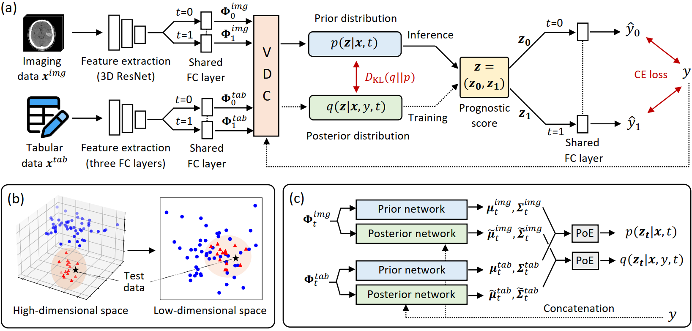

## Introduction

+ Pytorch implementation for paper **[Treatment Outcome Prediction for Intracerebral Hemorrhage via Generative Prognostic Model with Imaging and Tabular Data](https://arxiv.org/pdf/2307.12858)** 

<p align="center">

</p>

## Abstract
> Intracerebral hemorrhage (ICH) is the second most common and deadliest form of stroke. Despite medical advances, predicting treatment outcomes for ICH remains a challenge.
This paper proposes a novel prognostic model that utilizes both imaging and tabular data to predict treatment outcome for ICH. Our model is trained on observational data collected from non-randomized controlled trials, providing reliable predictions of treatment success. Specifically, we propose to employ a variational autoencoder model to generate a low-dimensional prognostic score, which can effectively address the selection bias resulting from the non-randomized controlled trials. Importantly, we develop a variational distributions combination module that combines the information from imaging data, non-imaging clinical data, and treatment assignment to accurately generate the prognostic score. We conducted extensive experiments on a real-world clinical dataset of intracerebral hemorrhage. Our proposed method demonstrates a substantial improvement in treatment outcome prediction compared to existing state-of-the-art approaches.

## Setup

### OS Requirements
This model has been tested on the following systems:

+ Linux: Ubuntu 18.04

```bash
Package                Version
---------------------- -------------------
torch                  1.4.0
torchvision            0.5.0
h5py                   3.1.0
opencv-python          4.5.2.52
SimpleITK              2.0.2
scikit-image.          0.17.2
ml-collections         0.1.1
tensorboardx           2.2.0
medpy                  0.4.0
scikit-learn           0.24.2
pandas                 1.1.5
```

## Training & Testing
+ This article uses a private dataset. In order to successfully run the code, you need to prepare your own dataset.
+ Specifically, you need to prepare a .xls file, which saves the patients' non-imaging clinical data and the path of imaging data. We have provided an example for you to run the data, which is saved in "./data/IPH/example.xls".
+ We run main_VAE.py to train and evaluate the model:
```bash 
python main_VAE.py
```
+ Our proposed model is saved in models.py, named "VAE_MM".

## Citation
If this repository is useful for your research, please cite:

       @inproceedings{ma2023treatment,
         title={Treatment Outcome Prediction for Intracerebral Hemorrhage via Generative Prognostic Model with Imaging and Tabular Data},
         author={Ma, Wenao and Chen, Cheng and Abrigo, Jill and Mak, Calvin Hoi-Kwan and Gong, Yuqi and Chan, Nga Yan and Han, Chu and Liu, Zaiyi and Dou, Qi},
         booktitle={International Conference on Medical Image Computing and Computer-Assisted Intervention},
         pages={715--725},
         year={2023},
         organization={Springer}
       }

## Contact
For any questions, please contact 'wama@cse.cuhk.edu.hk'

## License
This project is covered under the **Apache 2.0 License**.

